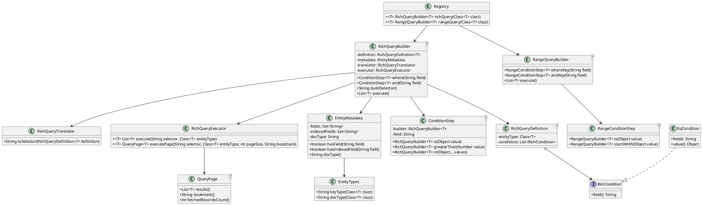
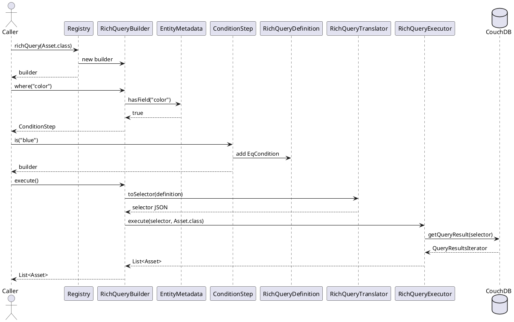

# Hypernate Rich Query Builder Proposal

## Summary

This challenge branch adds the first rich-query path to Hypernate's `Registry`.
It gives chaincode authors a fluent API for CouchDB selectors while keeping the
query construction, selector translation, entity typing, and result
materialization inside Hypernate.

The implemented slice is:

```java
List<Asset> results = registry.richQuery(Asset.class)
    .where("color").is("blue")
    .execute();
```

That slice covers:

- `Registry.richQuery(Class<T>)`
- metadata-backed field validation
- `where(...).is(...)`
- selector generation with `docType`
- persisted `docType` in entity JSON
- execution through `stub.getQueryResult(...)`
- typed deserialization of query results

It implements one vertical slice that proves the architecture and documents the next steps.

## Mentorship Fit

The LFDT mentorship focuses on turning advanced Fabric features into clean,
type-safe Hypernate APIs. This proposal covers the first expected deliverable:
a fluent query builder integrated into `Registry`.

It also follows the same design discipline needed for the later mentorship
features:

- cross-chaincode invocation will need a small caller-facing API plus
  serialization, channel targeting, and error handling behind it
- state-based endorsement will need declarative asset-level policy APIs plus
  Fabric policy operations behind them
- sample ports will test whether these abstractions fit real Fabric patterns

This branch does not implement cross-chaincode invocation, endorsement policies,
sample ports, or Fabric-network integration tests.
## Problem

Hypernate currently gives developers typed CRUD through `Registry`, composite
key construction through `@PrimaryKey`, and partial-key reads through Fabric key
APIs. Rich queries still require low-level CouchDB selector strings.

That leaves four gaps:

- developers write selector JSON by hand
- field names fail late if misspelled
- different entity types can match the same selector if their JSON fields
  overlap
- every contract that needs a query repeats translation and deserialization
  logic

The query builder moves those concerns into the framework.

## Codebase Findings

I found three middleware issues that shape the rich-query design.

`WriteBackCachedStubMiddleware` does not override `getQueryResult()`. Rich
queries go straight to the underlying Fabric stub, so they do not see
transaction-local writes buffered by the cache.

`WriteBackCachedStubMiddleware.dispose()` is not wired to the transaction-end
notification. Dirty cached writes will not flush unless another path calls
`dispose()`.

Blind deletes can be skipped by `dispose()`. The method checks
`item.getValue() == null` before checking `item.isToDelete()`, so a dirty delete
with no cached value can be ignored.

The challenge branch does not fix those middleware bugs. It uses the finding to
define the rich-query contract: `richQuery()` reads committed CouchDB state. A
future runtime warning or acknowledgement should make that contract explicit
when cached writes exist.

## Prior Art

Ektorp shows the useful split between a fluent query object and a later
execution step. Its query object accumulates state; the connector executes that
state.

JPA Criteria shows why query conditions should become objects rather than raw
strings. Hypernate uses `RichCondition` and `EqCondition` for the same reason:
the builder records intent, and the translator owns the target query format.

Java Streams provide the execution model. `where(...)` and `and(...)` are
intermediate operations. `execute()` is the terminal operation.

Fabric changes the design in two ways:

- CouchDB indexes are packaged with chaincode under
  `META-INF/statedb/couchdb/indexes/`, so `@QueryIndex` should describe intended
  access patterns rather than create indexes at runtime.
- Fabric manages rich-query pagination through its own pagination APIs, so a
  future paginated builder should call `getQueryResultWithPagination(...)`
  instead of relying on a CouchDB `limit` field.

## API Shape

The target rich-query API is:

```java
List<Asset> results = registry.richQuery(Asset.class)
    .where("color").is("blue")
    .and("size").greaterThan(10)
    .and("owner").in("Alice", "Bob")
    .sortBy("value", SortOrder.DESC)
    .limit(50)
    .execute();
```

The current branch implements the equality slice:

```java
List<Asset> results = registry.richQuery(Asset.class)
    .where("color").is("blue")
    .execute();
```

The next type-safety improvement is field references. The current API accepts
strings and validates them against metadata. A later version can support
generated field constants, for example `Asset.Fields.color`, through Lombok
`@FieldNameConstants` or a generated metamodel.

## Architecture

The rich-query path has five main parts:

| Type | Role |
|---|---|
| `Registry` | User-facing entrypoint through `richQuery(Class<T>)` |
| `RichQueryBuilder<T>` | Fluent API and builder-time validation |
| `RichQueryDefinition<T>` | Accumulated query state |
| `RichQueryTranslator` | Converts query state to CouchDB selector JSON |
| `RichQueryExecutor` | Calls Fabric and materializes typed results |
| `EntityMetadata` | Caches field names, query index metadata, and `docType` |
| `EntityTypes` | Resolves key type and persisted document type |
| `QueryPage<T>` | Future pagination result with records and Fabric bookmark metadata |
| `RangeQueryBuilder<T>` | Future composite-key query builder |
| `RangeConditionStep<T>` | Future operator step limited to key-range-safe operations |

Query lifecycle:

1. `Registry.richQuery(Asset.class)` creates a builder for `Asset`.
2. `where("color")` validates `color` against cached metadata.
3. `.is("blue")` records an `EqCondition`.
4. `buildSelector()` translates the definition into CouchDB selector JSON.
5. `execute()` passes that selector to `RichQueryExecutor`.
6. The executor calls `stub.getQueryResult(...)` and deserializes each result.

## Type Scoping With `docType`

Composite-key reads are scoped by key namespace. Rich queries are not. If
`Asset` and `Vehicle` both contain a `color` field, a selector on `color` can
match both unless the stored JSON contains an entity discriminator.

Hypernate now writes a `docType` field into stored entity JSON and injects the
same value into rich-query selectors.

Stored document:

```json
{
  "docType": "HU.BME.MIT.FTSRG.HYPERNATE.EXAMPLE.ASSET",
  "assetId": "asset1",
  "color": "blue"
}
```

Generated selector:

```json
{
  "selector": {
    "docType": "HU.BME.MIT.FTSRG.HYPERNATE.EXAMPLE.ASSET",
    "color": {
      "$eq": "blue"
    }
  }
}
```

`EntityTypes.docType(...)` uses `@DocType` when present. Without it, it falls
back to the fully qualified uppercase class name, matching the existing key
type convention.

This storage change creates a compatibility concern for ledgers that already
contain documents without `docType`. A migration or compatibility mode should
handle that in a future production rollout.

## Validation Strategy

The builder validates structural mistakes early:

- blank field names
- unknown field names
- duplicate conditions in the current equality-only slice
- null equality values

The executor handles runtime concerns:

- Fabric query failures
- iterator closing
- deserialization failures

Future runtime checks should cover:

- stale-read warnings when cached writes exist
- sort fields without matching `@QueryIndex` metadata
- pagination limits and unsupported backend capabilities

## Current vs Target Design

Current branch:

- `where(...).is(...)`
- implicit AND for multiple equality conditions
- `buildSelector()`
- `execute()`
- `docType` persistence
- field validation through `EntityMetadata`

Target design:

- `greaterThan(...)`
- `in(...)`
- `sortBy(...)`
- pagination through `getQueryResultWithPagination(...)` and `QueryPage<T>`
- range queries through composite keys
- separate operator steps for rich queries and range queries
- richer exception types for stale reads, index policy, and execution failures
- an AST model when boolean grouping becomes necessary

The rich and range builders should stay separate at the public API level.
Sharing a small internal operator base may reduce duplication, but a common
public `IQuery<T>` would make it harder to show which operations are safe for
CouchDB selectors and which are safe for composite-key traversal.

## UML Class Diagram



## UML Sequence Diagram



## Tradeoffs

| Decision | Choice | Cost |
|---|---|---|
| Query paths | Keep `richQuery()` and `rangeQuery()` separate | Larger API surface |
| Validation | Validate fields at builder time | More internal metadata code |
| Type scoping | Persist and query by `docType` | Stored JSON shape changes |
| Indexes | Treat `@QueryIndex` as metadata | Runtime cannot create indexes automatically |
| Scope | Implement one equality slice end to end | Operators and range queries remain future work |

## Remaining Work

1. Add stale-read warning or acknowledgement semantics for rich queries.
2. Use `@QueryIndex` metadata for `sortBy(...)` warnings or policy checks.
3. Implement `greaterThan(...)`, `in(...)`, `limit(...)`, and pagination.
4. Add `rangeQuery()` with `@PrimaryKey` order validation.
5. Add field-reference support through generated constants or a metamodel.
6. Add richer query exceptions for index policy, stale-read risk, and execution failures.
7. Move from a flat condition list to an AST when `or(...)` or grouping is added.

## Challenge Implementation

The implemented fluent operation is `ConditionStep.is(...)`. It proves the
viability of the builder because it forces the architecture to cover field
validation, condition representation, selector translation, type scoping, and
execution.

Tests cover:

- selector generation for `where(...).is(...)`
- automatic `docType` injection
- fully qualified uppercase `docType` fallback
- unknown-field rejection
- duplicate-condition rejection
- persisted `docType` during entity creation
- deserialization of documents containing `docType`
- `execute()` materialization from Fabric `getQueryResult(...)`

## References

[1] Hyperledger Fabric Documentation. *CouchDB as the State Database.*
https://hyperledger-fabric.readthedocs.io/en/latest/couchdb_as_state_database.html

[2] Hyperledger Fabric Documentation. *Using CouchDB - Create an Index.*
https://hyperledger-fabric.readthedocs.io/en/release-2.5/couchdb_tutorial.html

[3] Hyperledger Fabric Java Chaincode API. *ChaincodeStub.*
https://hyperledger.github.io/fabric-chaincode-java/main/api/org/hyperledger/fabric/shim/ChaincodeStub.html

[4] Hyperledger Fabric Samples. *Asset transfer ledger queries.*
https://github.com/hyperledger/fabric-samples/tree/main/asset-transfer-ledger-queries

[5] Ektorp. *Java API for CouchDB.*
https://helun.github.io/Ektorp/reference_documentation.html

[6] EclipseLink Documentation. *Criteria API.*
https://eclipse.dev/eclipselink/documentation/3.0/concepts/queries004.htm
